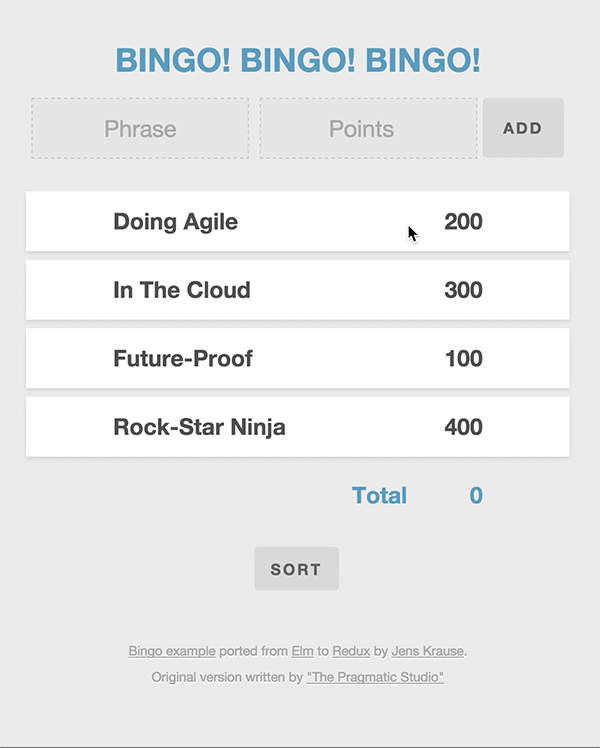

# Bingo example (originally written in Elm) ported to Redux

[Pragmatic Studio's](http://pragmaticstudio.com) has [an excellent `Elm` course](http://pragmaticstudio.com/elm) creating a small Bingo app. Because [`Redux` is inspired](https://github.com/rackt/redux/blob/master/docs/introduction/PriorArt.md#elm) by [`Elm`](http://elm-lang.org/) I ported this app to [`Redux`](https://github.com/rackt/redux/) .

Just for a better understanding of the relationship between `Elm` and `Redux`. And just for `fun` :)


### Screenshot




### Installation

```
git clone https://github.com/sectore/pragmaticstudio-bingo-redux.git
cd pragmaticstudio-bingo-redux
npm i
npm start
```


### Acknowledge
- [Original Bingo app](http://pragmaticstudio.com/elm) build by [Pragmatic Studio's](http://pragmaticstudio.com)
- `Redux` app skeleton based on [Redux examples](https://github.com/rackt/redux/tree/master/examples).

### License
[MIT](./LICENSE)

### Author
Jens Krause // [WEBSECTOR.DE](http://www.websector.de)
